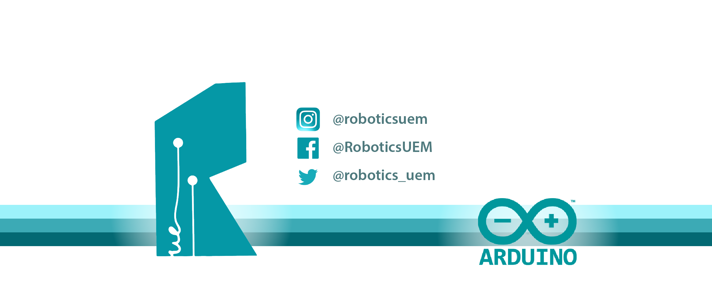

:Author: RoboticsClubUEM
:Email: roboticsclub@universidadeuropea.es
:Date: 19/01/2018
:Revision: version#1.0
:License: Dominio Público

= Tutoriales Sensores

Pequeño repositorio con tutoriales y documentación sobre los distintos sensores que usamos
en los proyectos del Robotics Club.

== Objetivo del proyecto

En el Robotics Club queremos enseñar a los estudiantes o makers lo simple que es
usar un sensor o módulo mediante el _weblearning_.

== Estructura del repositorio
SensorsTutorial +
├── final +
│   ├── https://github.com/RoboticsClubUEM/sensorstutorial/tree/master/final/7-segmentos[7 Segmentos]   => Display de números (0-9) +
│   ├── https://github.com/RoboticsClubUEM/sensorstutorial/tree/master/final/KY-002[KY 002]             => Sensor de vibración +
│   ├── https://github.com/RoboticsClubUEM/sensorstutorial/tree/master/final/KY-006[KY 006]             => Buzzer pasivo +
│   ├── https://github.com/RoboticsClubUEM/sensorstutorial/tree/master/final/KY-009[KY 009]             => Módulo SMD RGB +
│   ├── https://github.com/RoboticsClubUEM/sensorstutorial/tree/master/final/KY-010[KY 010]             => Sensor de bloqueo de luz +
│   ├── https://github.com/RoboticsClubUEM/sensorstutorial/tree/master/final/KY-012[KY 012]             => Buzzer activo +
│   ├── https://github.com/RoboticsClubUEM/sensorstutorial/tree/master/final/KY-016[KY 016]             => Módulo RGB +
│   ├── https://github.com/RoboticsClubUEM/sensorstutorial/tree/master/final/KY-019[KY 019]             => Relay de 5V AC +
│   ├── https://github.com/RoboticsClubUEM/sensorstutorial/tree/master/final/KY-021[KY 021]             => Mini reed switch +
│   ├── https://github.com/RoboticsClubUEM/sensorstutorial/tree/master/final/KY-023[KY 023]             => Joystick +
│   ├── https://github.com/RoboticsClubUEM/sensorstutorial/tree/master/final/KY-031[KY 031]             => Sensor de impacto +
│   └── https://github.com/RoboticsClubUEM/sensorstutorial/tree/master/final/LCD[LCD]                   => LCD 16x2 +
│ +
├── banner-robotics_club.png                                                                            => Banner del repositorio +
└── README.adoc                                                                                         => Presentación del repositorio

=== Licencia

Este proyecto se publica bajo una Licencia de {License}.

=== Contribuciones

Para contribuir con el proyecto contacta con roboticsclub@universidadeuropea.es

=== Ayuda

Este documento está escrito en formato _AsciiDoc_, un lenguaje tipo markdown para
escribir documentos.
Si necesitas ayuda puedes buscar en la http://www.methods.co.nz/asciidoc[AsciiDoc homepage]
o consultar http://powerman.name/doc/asciidoc[AsciiDoc cheatsheet]
