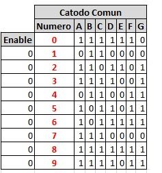
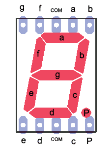
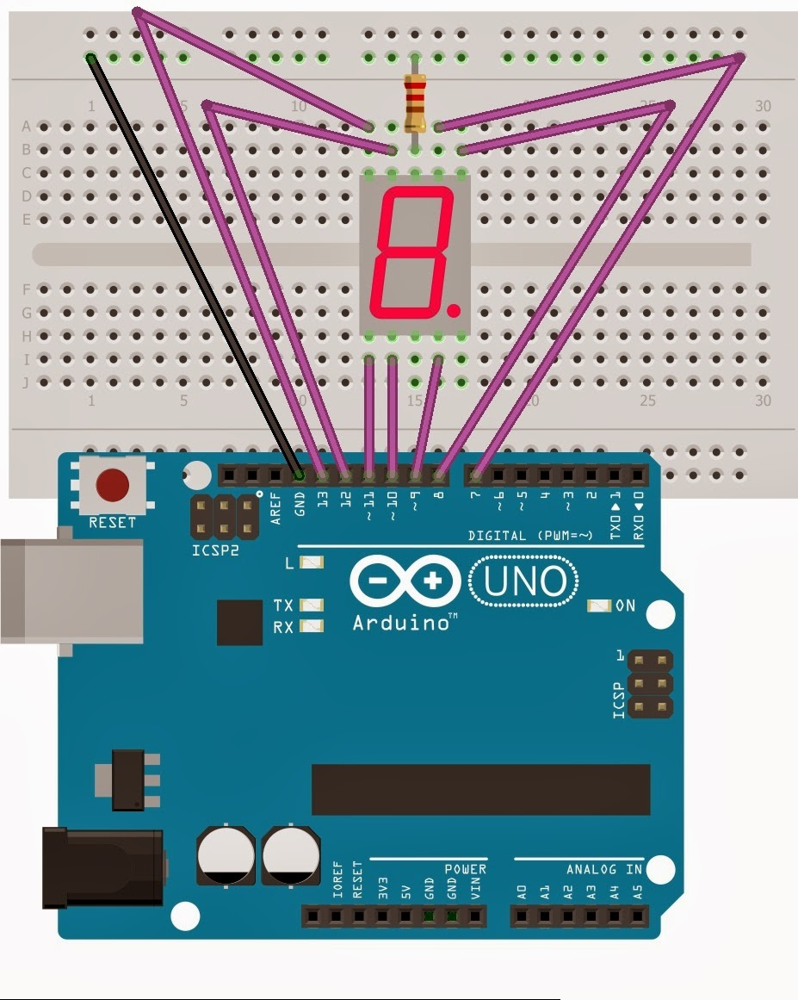

:Author: RoboticsClubUEM
:Email: roboticsclub@universidadeuropea.es
:Date: 18/04/2018
:Revision: version#1.0
:License: Dominio Público

= DISPLAY 7 SEGMENTOS CÁTODO COMÚN

== Descripción

En los 7 segmentos de cátodo común, el punto circuital en común para todos los
Led es el cátodo GND. Mientras que el ánodo común el punto de
referencia es Vcc. +

Cada LED trabaja con tensiones y corrientes bajas,  por lo tanto se pueden
conectar directamente a puertas lógicas o pines de salida de un microcontrolador.
Siempre es recomendable conectar una resistencia en serie entre el pin de la
salida del microcontrolador y el de entrada del 7 segmentos, para aumentar la
vida útil de estos. La intensidad lumínica dependerá del valor de la resistencia. +

Tabla de verdad

== Características

* Dispositivo para representación visual +
* Todos los cátodos (-) de los leds comparten la misma conexión. +
* Consta de 7 LED's, uno por cada segmento. +
* Estos diplays requieren un '1' lógico a la entrada de cada segmento para encenderlo. +

== Esquema del circuito

Salida de pines +

Esquema de conexiones +

=== Carga el código

Carga el código en tu placa mediante el Arduino IDE.

=== Estructura del directorio

....
 7-segmentos
  ├── 7seg.ino                          => Código de Arduino
  ├── 7seg-pinout.png                   => Salida de los pines del sensor
  ├── 7seg-schema.png                   => Esquema de conexiones
  ├── 7seg-table.png                    => Tabla de verdad
  └── README.adoc                       => Presentación del repositorio
....

=== Referencias

http://elcajondeardu.blogspot.com.es/2014/04/display-de-7-segmentos-1-digito.html[ElCajonDeArduino] +
http://teslabem.com/display-7-segmentos-catodo.html[Teslabem] +

=== Licencia

Este proyecto se publica bajo una Licencia de {License}.

=== Ayuda

Este documento está escrito en formato _AsciiDoc_, un lenguaje tipo markdown para
escribir documentos.
Si necesitas ayuda puedes buscar en la http://www.methods.co.nz/asciidoc[AsciiDoc homepage]
o consultar http://powerman.name/doc/asciidoc[AsciiDoc cheatsheet]
