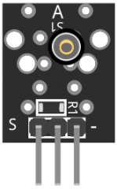
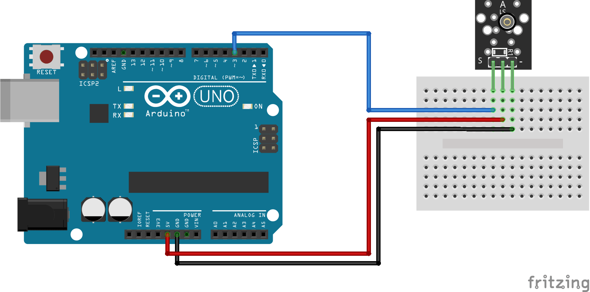

:Author: RoboticsClubUEM
:Email: roboticsclub@universidadeuropea.es
:Date: 18/04/2018
:Revision: version#1.0
:License: Dominio Público

= KY-002 o SENSOR DE VIBRACIÓN

== Descripción

Este módulo permitirá detectar de forma fácil, rápida y precisa la vibración
producida en el lugar en el cual este se encuentre. Posee un sensor capacitado
para detectar las diversas vibraciones producidas en un ambiente.
Por ello, lo puedes anclar literalmente a cualquier cosa y saber cuándo
esta se mueve o se golpea. Este módulo es compatible con Arduino o con cualquier
Microcontrolador que posea un pin de 5 Volts. +

Este módulo detector de vibraciones funciona como un switch, al detectar una
vibración cierra un circuito lo que genera que el usuario pueda detectar los
movimientos. +

== Características

* Voltaje de funcionamiento: 3.3V ~ 5V
* Interruptor digital salida (0 / 1)
* Material: PCB
* Dimensiones: 2.4x1.5x0.9

== Esquema del circuito

Salida de pines +

Esquema de conexiones +

=== Carga el código

Carga el código en tu placa mediante el Arduino IDE.

=== Estructura del directorio

....
 KY-002
  ├── KY_002.ino                        => Código de Arduino
  ├── KY_002-pinout.png                 => Salida de los pines del sensor
  ├── KY_002-schema.png                 => Esquema de conexiones
  └── README.adoc                       => Presentación del repositorio
....

=== Referencias

http://linksprite.com/wiki/index.php5?title=Advanced_Sensors_Kit_for_Arduino[LinkSprite] +
http://www.electronicapty.com/tienda/modulos-y-sensores-para-arduino/modulo-sensor-de-vibracion-ky-002-para-arduino-detail[ElectronicaPTY] +
https://arduinomodules.info/ky-002-vibration-switch-module/[ArduinoModules] +

=== Licencia

Este proyecto se publica bajo una Licencia de {License}.

=== Ayuda

Este documento está escrito en formato _AsciiDoc_, un lenguaje tipo markdown para
escribir documentos.
Si necesitas ayuda puedes buscar en la http://www.methods.co.nz/asciidoc[AsciiDoc homepage]
o consultar http://powerman.name/doc/asciidoc[AsciiDoc cheatsheet]
