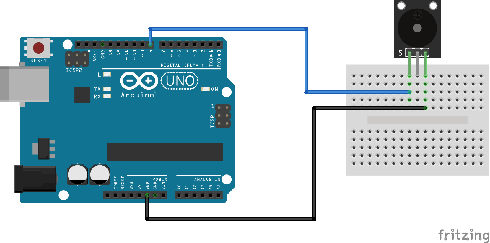

:Author: RoboticsClubUEM
:Email: roboticsclub@universidadeuropea.es
:Date: 18/04/2018
:Revision: version#1.0
:License: Dominio Público

= KY-006 o BUZZER PASIVO

== Descripción

Este módulo permitirá generar de forma fácil, rápida y precisa sonidos, posee un
sensor vibrador que oscila a una frecuencia determinada. Este módulo es
compatible con Arduino o con cualquier Microcontrolador que posea un pin de 5 Volts. +

Este módulo contiene un buzzer pasivo, el cual posee su propia frecuencia de
oscilación que permite generar un tono o pitido cuando es alimentado (cuando el
pin de señal S se pone en alto), el buzzer se activa emitiendo un
pitido constante, y cuando está en bajo, no genera sonido alguno. +

== Características

* Voltaje de funcionamiento: 3.3V ~ 5V
* Corriente de operación: <25mA
* Frecuencia emitida: 500 ± 250 Hz
* Material: PCB
* Dimensiones: 1.9x1.5x1.2cm

== Esquema del circuito

Salida de pines +

Esquema de conexiones +

=== Carga el código

Carga el código en tu placa mediante el Arduino IDE.

=== Estructura del directorio

....
 KY-006
  ├── KY_006.ino                        => Código de Arduino
  ├── KY_006-pinout.png                 => Salida de los pines del sensor
  ├── KY_006-schema.png                 => Esquema de conexiones
  └── README.adoc                       => Presentación del repositorio
....

=== Referencias

http://linksprite.com/wiki/index.php5?title=Advanced_Sensors_Kit_for_Arduino[LinkSprite] +
http://www.electronicapty.com/tienda/modulos-y-sensores-para-arduino/modulo-zumbador-pasivo-ky-006-para-arduino-detail[ElectronicaPTY] +
https://programmingelectronics.com/an-easy-way-to-make-noise-with-arduino-using-tone/[ProgrammingElectronics] +
https://arduinomodules.info/ky-006-passive-buzzer-module/[ArduinoModules] +

=== Licencia

Este proyecto se publica bajo una Licencia de {License}.

=== Ayuda

Este documento está escrito en formato _AsciiDoc_, un lenguaje tipo markdown para
escribir documentos.
Si necesitas ayuda puedes buscar en la http://www.methods.co.nz/asciidoc[AsciiDoc homepage]
o consultar http://powerman.name/doc/asciidoc[AsciiDoc cheatsheet]
