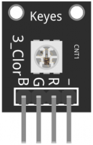
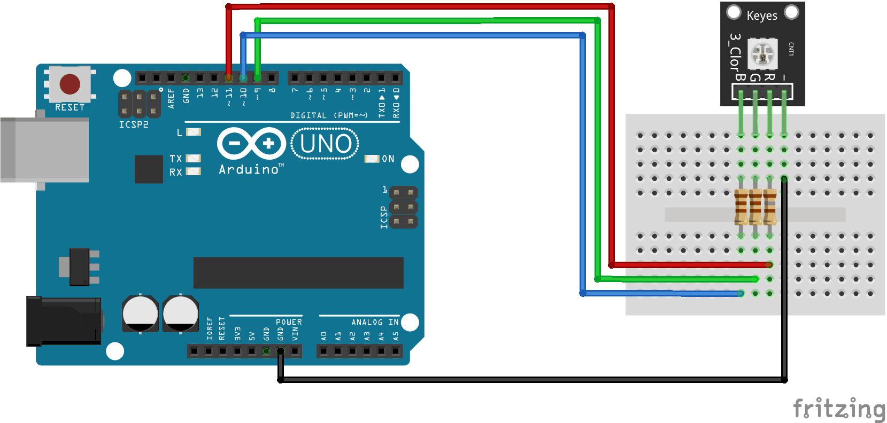

:Author: RoboticsClubUEM
:Email: roboticsclub@universidadeuropea.es
:Date: 18/04/2018
:Revision: version#1.0
:License: Dominio Público

= KY-009 o MÓDULO SMD RGB

== Descripción

El Módulo LED SMD RGB, consiste en un LED capaz de crear cualquier color
utilizando RGB, tiene una entrada de voltaje PWM con tres pines. Los colores
primarios (Red / Green / Blue) son usados con el fin de lograr el efecto de
mezclar colores y obtener cualquier color deseado. Con este módulo se pueden
crear efectos de color muy llamativos. +

Los diodos LED son usados para indicar estados, iluminar o simplemente como
decoración. Estos son capaces de lucir en una amplia gama de colores gracias a
la mezcla de los tres colores primarios (rojo, verde y azul). Ha este tipo de
diodos se les llama RGB y están compuesto por tres diodos de color rojo, verde y
azul en un mismo encapsulado. Gracias a la variación de la intensidad de estos
tres diodos, podemos crear una composición de colores. +

Con este LED puedes manejar más de 16.5 millones de colores. Pero recuerda que
como cualquier LED es recomendable poner una resistencia limitadora de entre
100 y 220 a la entrada de cada pin (R,G,B). +

== Características

* Voltaje de funcionamiento: 3.3V ~ 5V
* Material: PCB
* Dimensiones: 1.9x1.5x0.5cm

== Esquema del circuito

Salida de pines +

Esquema de conexiones +

=== Carga el código

Carga el código en tu placa mediante el Arduino IDE.

=== Estructura del directorio

....
 KY-009
  ├── KY_009.ino                        => Código de Arduino
  ├── KY_009-pinout.png                 => Salida de los pines del sensor
  ├── KY_009-schema.png                 => Esquema de conexiones
  └── README.adoc                       => Presentación del repositorio
....

=== Referencias

http://linksprite.com/wiki/index.php5?title=Advanced_Sensors_Kit_for_Arduino[LinkSprite] +
http://www.electronicapty.com/tienda/modulos-y-sensores-para-arduino/modulo-led-smd-rgb-ky-009-para-arduino-detail[ElectronicaPTY] +
https://arduinomodules.info/ky-009-rgb-full-color-led-smd-module/[ArduinoModules]

=== Licencia

Este proyecto se publica bajo una Licencia de {License}.

=== Ayuda

Este documento está escrito en formato _AsciiDoc_, un lenguaje tipo markdown para
escribir documentos.
Si necesitas ayuda puedes buscar en la http://www.methods.co.nz/asciidoc[AsciiDoc homepage]
o consultar http://powerman.name/doc/asciidoc[AsciiDoc cheatsheet]
