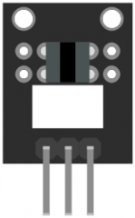

:Author: RoboticsClubUEM
:Email: roboticsclub@universidadeuropea.es
:Date: 18/04/2018
:Revision: version#1.0
:License: Dominio Público

= KY-010 o SENSOR DE BLOQUEO DE LUZ (FOTOINTERRUPTOR)

== Descripción

Este módulo especialmente diseñado para Arduino te permitirá detectar de forma
fácil, rápida y precisa cuando un objeto se atraviesa en el medio de la juntura
en forma de U. Posee un sensor el cual tiene la capacidad de detectar las
diversas interrupciones producidas en el interior de la U, este módulo es
compatible con Arduino y se usa mucho como encoder. +

también son conocidos como sensores de interrupción, su funcionamiento es
muy simple cuando un objeto de cualquier tipo atraviesa la "Cámara de Aire"
el sensor envía un 1 al sistema que censa, por ello al poner una rueda con
orificios ajustados a cierto número de grados y unida a un eje de motor es fácil
determinar la velocidad a la que el motor está girando y el ángulo en el cual esta. +

== Características

* Voltaje de funcionamiento: 3.3V ~ 5V
* Interruptor digital salida (0 / 1)
* Material: PCB
* Dimensiones: 2.4x1.5x0.9cm

== Esquema del circuito

Salida de pines +

image::KY_010-schema.png[Esquema de Conexiones]
Esquema de conexiones +

=== Carga el código

Carga el código en tu placa mediante el Arduino IDE.

=== Estructura del directorio

....
 KY-010
  ├── KY_010.ino                        => Código de Arduino
  ├── KY_010-pinout.png                 => Salida de los pines del sensor
  ├── KY_010-schema.png                 => Esquema de conexiones
  └── README.adoc                       => Presentación del repositorio
....

=== Referencias

http://linksprite.com/wiki/index.php5?title=Advanced_Sensors_Kit_for_Arduino[LinkSprite] +
http://www.electronicapty.com/tienda/modulos-y-sensores-para-arduino/modulo-fotointerruptor-ky-010-detail[ElectronicaPTY] +
https://arduinomodules.info/ky-010-photo-interrupter-module/[ArduinoModules] +

=== Licencia

Este proyecto se publica bajo una Licencia de {License}.

=== Ayuda

Este documento está escrito en formato _AsciiDoc_, un lenguaje tipo markdown para
escribir documentos.
Si necesitas ayuda puedes buscar en la http://www.methods.co.nz/asciidoc[AsciiDoc homepage]
o consultar http://powerman.name/doc/asciidoc[AsciiDoc cheatsheet]
