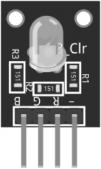
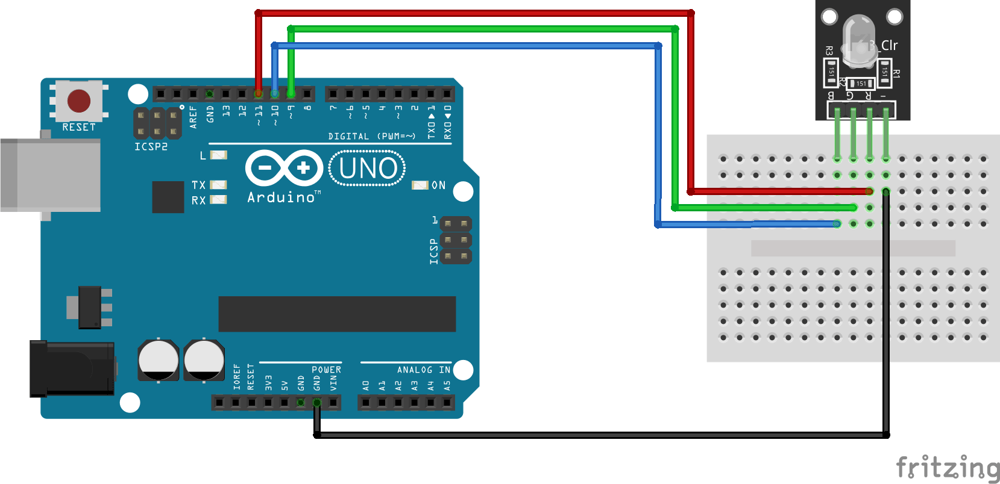

:Author: RoboticsClubUEM
:Email: roboticsclub@universidadeuropea.es
:Date: 19/04/2018
:Revision: version#1.0
:License: Dominio Público

= KY-016 o MÓDULO RGB

== Descripción

Módulo LED RGB se compone de un plug-in LED a todo color fabricado por R, G, B
tensión PWM de tres clavijas de entrada se puede ajustar la sección tres colores
primarios (rojo / verde azul /) de fuerza con el fin de lograr el pleno efecto
de color de mezcla. Control del módulo con el Arduino se puede lograr efectos de
iluminación fresco. +

== Características

* El uso de plug-in de color LED
* RGB tricromática resistencia de limitación para prevenir el agotamiento
* A través de la PWM ajustar tres colores primarios se pueden mezclar para obtener diferentes colores
* Con una variedad de interfaz de un solo chip
* El voltaje de funcionamiento: 5V
* El modo de excitación de LED: conductor de cátodo común

== Esquema del circuito

Salida de pines +

Esquema de conexiones +

=== Carga el código

Carga el código en tu placa mediante el Arduino IDE.

=== Estructura del directorio

....
 KY-016
  ├── KY_016.ino                        => Código de Arduino
  ├── KY_016-pinout.png                 => Salida de los pines del sensor
  ├── KY_016-schema.png                 => Esquema de conexiones
  └── README.adoc                       => Presentación del repositorio
....

=== Referencias

http://linksprite.com/wiki/index.php5?title=Advanced_Sensors_Kit_for_Arduino[LinkSprite] +
http://www.electronicapty.com/tienda/modulos-y-sensores-para-arduino/modulo-led-3-colores-ky-016-para-arduino-detail[ElectronicaPTY] +
https://arduinomodules.info/ky-016-rgb-full-color-led-module/[ArduinoModules] +

=== Licencia

Este proyecto se publica bajo una Licencia de {License}.

=== Ayuda

Este documento está escrito en formato _AsciiDoc_, un lenguaje tipo markdown para
escribir documentos.
Si necesitas ayuda puedes buscar en la http://www.methods.co.nz/asciidoc[AsciiDoc homepage]
o consultar http://powerman.name/doc/asciidoc[AsciiDoc cheatsheet]
