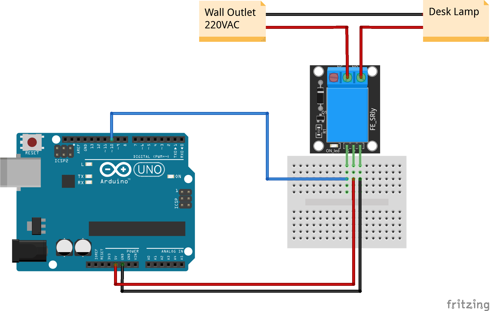

:Author: RoboticsClubUEM
:Email: roboticsclub@universidadeuropea.es
:Date: 19/04/2018
:Revision: version#1.0
:License: Dominio Público

= KY-019 o RELAY DE 5V AC

== Descripción

El módulo Relay es capaz de activarse con 5VDC lo que permite aplicaciones como
interruptores de potencia, además cuenta con una entrada de señal TTL con la cual
se puede controlar el disparo del relé; por el otro lado cuenta con un contactor
de tres salidas una común, la otra normalmente abierta y la otra normalmente
cerrada. Diseñado para trabajar con cualquier placa de Arduino. +

== Características

* 5 V-12V a la TTL señal de control
* La señal de control de CC o la carga AC, AC 220V pueden ser controlados.
* Normalmente abierto y uno contactos normalmente cerrados
* La luz indicadora de encendido
* Indicador de control, hale, desconecte no brilla

== Esquema del circuito

image::KY_019-pinout.png[Pines]
Salida de pines +

Esquema de conexiones +

=== Carga el código

Carga el código en tu placa mediante el Arduino IDE.

=== Estructura del directorio

....
 KY-019
  ├── KY_019.ino                        => Código de Arduino
  ├── KY_019-pinout.png                 => Salida de los pines del sensor
  ├── KY_019-schema.png                 => Esquema de conexiones
  └── README.adoc                       => Presentación del repositorio
....

=== Referencias

http://linksprite.com/wiki/index.php5?title=Advanced_Sensors_Kit_for_Arduino[LinkSprite] +
http://www.electronicapty.com/tienda/modulos-y-sensores-para-arduino/modulo-relay-ky-019-para-arduino-detail[ElectronicaPTY] +
https://arduinomodules.info/ky-019-5v-relay-module/[ArduinoModules]

=== Licencia

Este proyecto se publica bajo una Licencia de {License}.

=== Ayuda

Este documento está escrito en formato _AsciiDoc_, un lenguaje tipo markdown para
escribir documentos.
Si necesitas ayuda puedes buscar en la http://www.methods.co.nz/asciidoc[AsciiDoc homepage]
o consultar http://powerman.name/doc/asciidoc[AsciiDoc cheatsheet]
