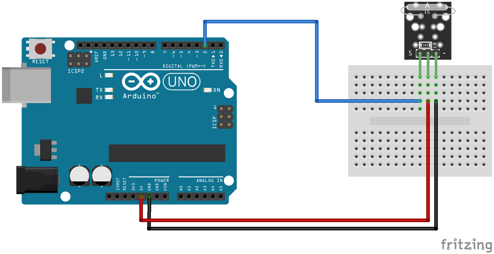

:Author: RoboticsClubUEM
:Email: roboticsclub@universidadeuropea.es
:Date: 19/04/2018
:Revision: version#1.0
:License: Dominio Público

= KY-021 o MINI REED SWITCH

== Descripción

Este módulo te permitirá detectar campos magnéticos de una forma rápida, fácil y
eficiente, con la mini lámina magnética. Es un sensor que se encuentra comúnmente
abierto y al detectar un campo magnético se cierra, permitiendo el paso del
voltaje. Este módulo incluye una resistencia de 10 kΩ y no es necesario
adicionar ninguna otro resistencia. +

== Características

* Voltaje de funcionamiento: 3.3V ~ 5V
* Material: PCB
* Dimensiones: 2.1x1.5x0.9cm

== Esquema del circuito

image::KY_021-pinout.png[Pines]
Salida de pines +

Esquema de conexiones +

=== Carga el código

Carga el código en tu placa mediante el Arduino IDE.

=== Estructura del directorio

....
 KY-021
  ├── KY_021.ino                        => Código de Arduino
  ├── KY_021-pinout.png                 => Salida de los pines del sensor
  ├── KY_021-schema.png                 => Esquema de conexiones
  └── README.adoc                       => Presentación del repositorio
....

=== Referencias

http://linksprite.com/wiki/index.php5?title=Advanced_Sensors_Kit_for_Arduino[LinkSprite] +
http://www.electronicapty.com/tienda/modulos-y-sensores-para-arduino/modulo-sensor-de-contacto-con-mini-lamina-magn%C3%A9tica-ky-021-para-arduino-detail[ElectronicaPTY] +
https://arduinomodules.info/ky-021-mini-magnetic-reed-switch-module/[ArduinoModules] +

=== Licencia

Este proyecto se publica bajo una Licencia de {License}.

=== Ayuda

Este documento está escrito en formato _AsciiDoc_, un lenguaje tipo markdown para
escribir documentos.
Si necesitas ayuda puedes buscar en la http://www.methods.co.nz/asciidoc[AsciiDoc homepage]
o consultar http://powerman.name/doc/asciidoc[AsciiDoc cheatsheet]
