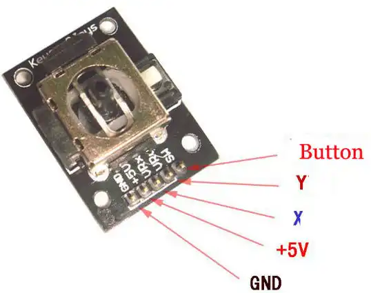
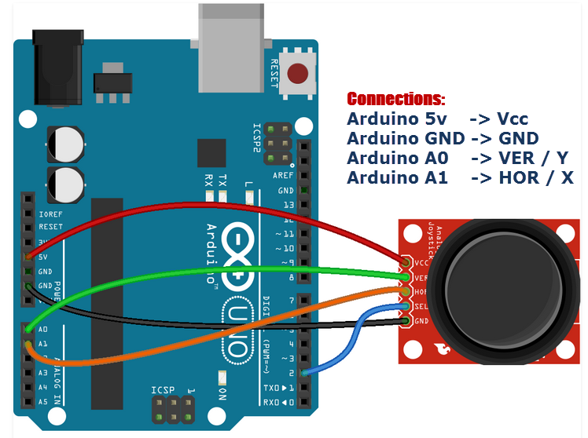

:Author: RoboticsClubUEM
:Email: roboticsclub@universidadeuropea.es
:Date: 19/04/2018
:Revision: version#1.0
:License: Dominio Público

= KY-023 o JOYSTICK

== Descripción

Te permite traducir los movimientos direccionales realizados por la palanca mediante
su doble eje (X-Y), funcionando a través de potenciómetros. Su fácil funcionamiento y
manejo le permitirá generar palancas para controlar robots o jugar juegos de
manera sencilla. +

== Características

* Voltaje de funcionamiento: 5v.
* Número de ejes: 2 (X - Y).
* Número de potenciómetros: 2 de 10Kohm.
* Pulsador central normalmente abierto.
* Número de Pines: 5 (GND, +5V , VRx, VRy, SW).
* Movimientos direccionales son simplemente dos potenciómetros - uno para cada eje
* Compatible con la interfaz de Arduino
* Material: PCB
* Dimensiones: 4,0 cm x 2,6 cm x 3,2 cm

== Esquema del circuito

Salida de pines +

Esquema de conexiones +

=== Carga el código

Carga el código en tu placa mediante el Arduino IDE.

=== Estructura del directorio

....
 KY-023
  ├── KY_023.ino                        => Código de Arduino
  ├── KY_023-pinout.png                 => Salida de los pines del sensor
  ├── KY_023-schema.png                 => Esquema de conexiones
  └── README.adoc                       => Presentación del repositorio
....

=== Referencias

http://linksprite.com/wiki/index.php5?title=Advanced_Sensors_Kit_for_Arduino[LinkSprite] +
http://www.electronicapty.com/tienda/modulos-y-sensores-para-arduino/modulo-joystick-ky-023-para-arduino-detail[ElectronicaPTY] +
http://www.web-robotica.com/arduino/como-utilizar-el-modulo-joystick-con-arduino[Web Robotica] +

=== Licencia

Este proyecto se publica bajo una Licencia de {License}.

=== Ayuda

Este documento está escrito en formato _AsciiDoc_, un lenguaje tipo markdown para
escribir documentos.
Si necesitas ayuda puedes buscar en la http://www.methods.co.nz/asciidoc[AsciiDoc homepage]
o consultar http://powerman.name/doc/asciidoc[AsciiDoc cheatsheet]
