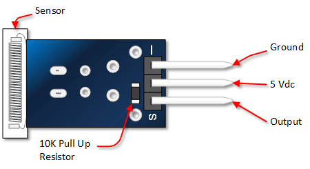
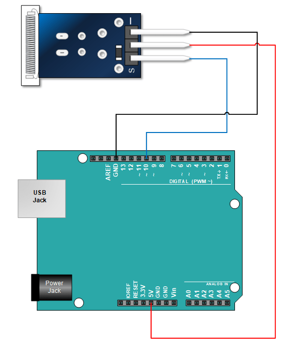

:Author: RoboticsClubUEM
:Email: roboticsclub@universidadeuropea.es
:Date: 18/04/2018
:Revision: version#1.0
:License: Dominio Público

= KY-031 o SENSOR DE IMPACTO

== Descripción

Este módulo es un sensor de impacto que tiene la capacidad de percibir los impactos
que este o que una superficie sujeto a este pueda recibir, la información de impacto
es transformada por el sensor y enviada a la placa Arduino o a un Microcontrolador
para que dispongas de esta según las necesidades de tu proyecto. +

Especialmente diseñado para Arduino te permitirá detectar de forma
fácil y rápida fuertes vibraciones o golpes producido al sensor a la superficie
en la que este anclado, por ello lo puedes anclar literalmente a cualquier cosa
y saber cuándo esta se mueve o se golpea, este módulo sensor de vibraciones entrega
información sobre el impacto y al detectar una vibración envía una señal que permite
detectar los movimientos funcionando como un switch que detecta la vibración que
generan los golpes. +

== Características

* Voltaje de funcionamiento: 5V +
* interruptor digital salida (0 / 1) +
* Material: PCB +
* Dimensiones: 1.9x1.5x0.9cm +

== Esquema del circuito

Salida de pines +

Esquema de conexiones +

=== Carga el código

Carga el código en tu placa mediante el Arduino IDE.

=== Estructura del directorio

....
 KY-031
  ├── KY_031.ino                        => Código de Arduino
  ├── KY_031-pinout.png                 => Salida de los pines del sensor
  ├── KY_031-schema.png                 => Esquema de conexiones
  └── README.adoc                       => Presentación del repositorio
....

=== Referencias

http://henrysbench.capnfatz.com/henrys-bench/arduino-sensors-and-input/keyes-ky-031-arduino-knock-impact-sensor-manual-and-tutorial[Henrys Bench Tutorials] +
https://electronicastore.net/tutorial-usar-el-sensor-ky-031-y-arduino-programacion[Electronica Store] +
http://www.electronicapty.com/tienda/modulos-y-sensores-para-arduino/modulo-sensor-de-impacto-ky-031-para-arduino-detail[ElectronicaPTY] +

=== Licencia

Este proyecto se publica bajo una Licencia de {License}.

=== Ayuda

Este documento está escrito en formato _AsciiDoc_, un lenguaje tipo markdown para
escribir documentos.
Si necesitas ayuda puedes buscar en la http://www.methods.co.nz/asciidoc[AsciiDoc homepage]
o consultar http://powerman.name/doc/asciidoc[AsciiDoc cheatsheet]
