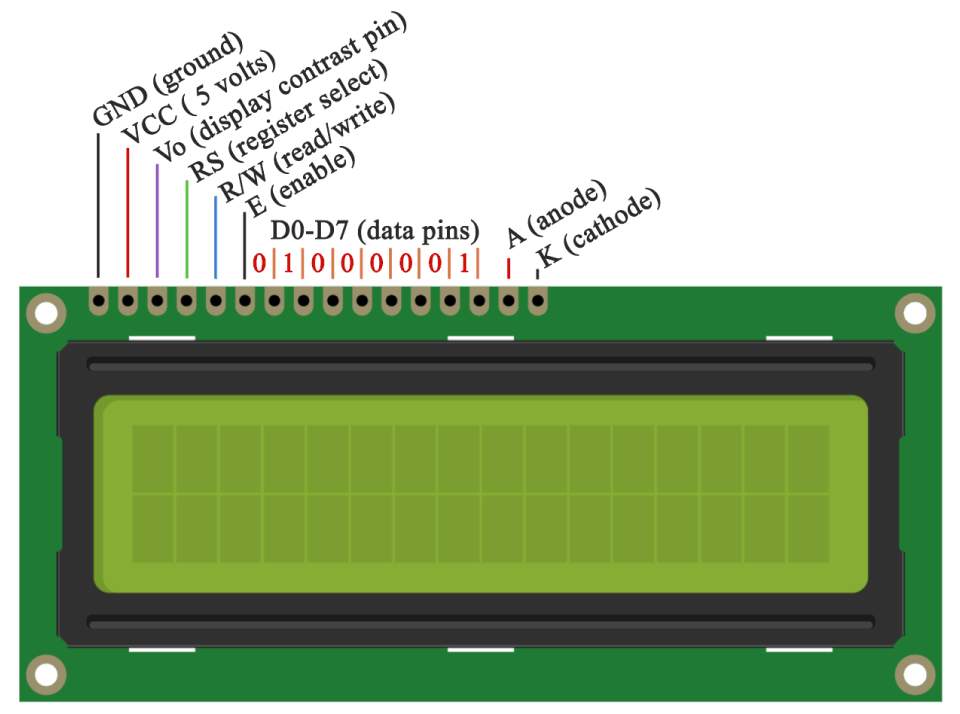

:Author: RoboticsClubUEM
:Email: roboticsclub@universidadeuropea.es
:Date: 19/04/2018
:Revision: version#1.0
:License: Dominio Público

= LCD

== Descripción

Descripcion Generica +

== Características

* Pin 1 –> GND
* Pin 2 –> VCC (+5V)
* Pin 3 –> Voltaje de contraste. Se conecta a un potenciómetro.
* Pin 4 –> Selección de registro. Aquí se selecciona el dispositivo para su uso.
* Pin 5 –> Lectura/Escritura. Dependiendo del estado (HIGH o LOW), se podrá escribir o leer datos en el LCD
* Pin 6 –> Enable. Es el pin que habilita o deshabilita el LCD.
* Pin 7 hasta Pin 14 –> Son los pines de datos por donde se envía o recibe información.
* Pin 15 –> El ánodo del LED de iluminación de fondo (+5v).
* Pin 16 –> El cátodo del LED de iluminación de fondo (GND).

== Esquema del circuito

Salida de pines +

image::LCD-schema.png[Esquema de Conexiones]
Esquema de conexiones +

=== Carga el código

Carga el código en tu placa mediante el Arduino IDE.

=== Estructura del directorio

....
 LCD
  ├── LCD.ino                       => Código de Arduino
  ├── LCD-pinout.png                => Salida de los pines del sensor
  ├── LCD-schema.png                => Esquema de conexiones
  └── README.adoc                   => Presentación del repositorio
....

=== Referencias

http://linksprite.com/wiki/index.php5?title=Advanced_Sensors_Kit_for_Arduino[LinkSprite] +
http://www.electronicapty.com/tienda/modulos-y-sensores-para-arduino/modulo-sensor-de-sonido-c-s-digital-ky-037-para-arduino-detail[ElectronicaPTY] +
http://panamahitek.com/uso-de-pantalla-lcd-con-arduino/[panamahitek] +
http://www.arduino.cc/en/Tutorial/LiquidCrystalHelloWorld[Aruino Tutorials] +

=== Licencia

Este proyecto se publica bajo una Licencia de {License}.

=== Ayuda

Este documento está escrito en formato _AsciiDoc_, un lenguaje tipo markdown para
escribir documentos.
Si necesitas ayuda puedes buscar en la http://www.methods.co.nz/asciidoc[AsciiDoc homepage]
o consultar http://powerman.name/doc/asciidoc[AsciiDoc cheatsheet]
